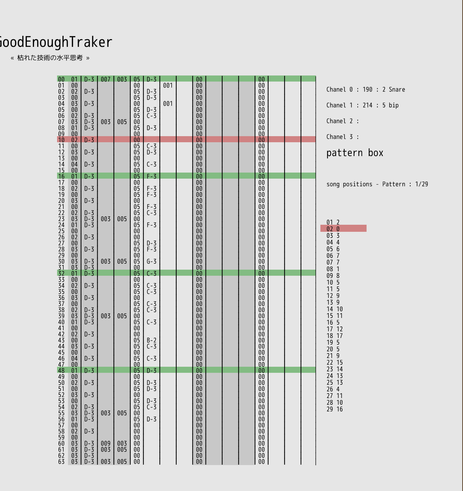

# dr_mod

Amiga mod loader and player for dragonruby



# Base documents

This MOD player is base on those 2 document

https://ftp.modland.com/pub/documents/format_documentation/Protracker%20effects%20(MODFIL12.TXT)%20(.mod).txt

https://www.lim.di.unimi.it/IEEE/VROS/FAQ/CRAMIG2.HTM

I curently can read patterns but I have issue with the sample frequency audio play.
If you have any hint please open an issue.

a nice vidéo to explain what it is

https://www.youtube.com/watch?v=0_6eBiouooo&t=30s

## Additional links

https://github.com/rombankzero/pocketmod/blob/master/pocketmod.h

https://github.com/electronoora/webaudio-mod-player/blob/master/js/pt.js

# How to use it.

For now there is 2 screen

1. main   screen, with the traker
2. sample screen, with the sample visualisation

## key

on main screen you can press
1. 'space' to play
2. 's' to go to the sample screen
3. 'r' to reset

on the sample screen you can press

1. 'c' to go back to tracker screen
2. 'todo' to play sample
3. 'todo' on play mode press a note key to play it
4. 'todo' to switch notation system, English and frensh

# Why I implement more than one notation system.

1. I'm french so I learn music with the french system (make sence).
2. It's more easy to debug something that is more easy to read and understand
   for you.
3. I belive the more you train you brain with cultural difference, the bettre
   you understand what difference and history mean, and become a more savy and
   good citizen :) :) (don't fight make people smart :) )

# Run the tests

Test are write with dr_spec

you can run them by typing

```
 dragonruby . --eval app/tests.rb --no-tick
 # --spec-tags traker, sampler
 # tag are not used now
```

## Adding spec

Lib spec are in
```
  lib/dr_mod_tracker/spec/*_spec.rb
```


# Pull request

Pull request are welcome.
Test must pass without regression.

Any design discussion or documentation are welcome too.
