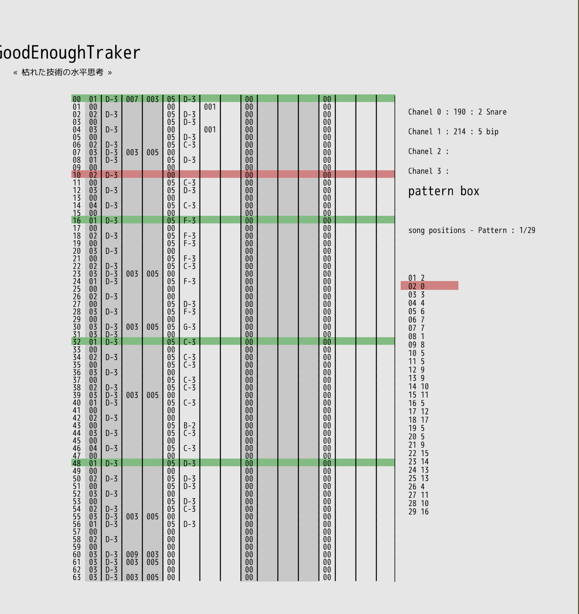

# dr_mod

Amiga MOD file loader and player for DragonRuby Game Toolkit.

Parses ProTracker 1.1B `.mod` files, displays an interactive tracker UI,
and plays samples with waveform visualization.



## Features

- ProTracker MOD file parsing (31 samples, 4 channels)
- Interactive tracker view with colored beat lines
- Sample view with waveform visualization
- Amiga-accurate frequency calculation (PAL clock)
- Finetune and per-sample volume support
- FR keyboard layout for note input (EN and BEPO planned)

## Getting Started

dr_mod requires [DragonRuby Game Toolkit](https://dragonruby.org/).

```bash
# Launch the game
dragonruby path/to/dr_mod

# Run the tests
dragonruby path/to/dr_mod --eval app/tests.rb --no-tick --exit-on-fail
```

## Controls

### Tracker view (main screen)

| Key | Action |
|-----|--------|
| Space | Play / Pause |
| M | Toggle sound on/off |
| Up/Down | Navigate lines |
| Left/Right | Previous/Next pattern |
| S | Switch to Sample view |
| R | Reset game |

### Sample view

| Key | Action |
|-----|--------|
| I | Play sample |
| U | Stop |
| J/K | Next/Previous sample |
| O/P | Sample rate up/down |
| D R M F S L T | Play note (Do Re Mi Fa Sol La Si) |
| C | Back to Tracker view |

## Git Flow

| Branch | Role |
|--------|------|
| `master` | Production stable. Never commit directly. |
| `develop` | Integration branch. Features are merged here. |
| `feature/*` | Development branches, created from `develop`. |

## Development Setup

DragonRuby is a standalone runtime — the `Gemfile` is for linting only.

```bash
bundle install
lefthook install
```

Pre-commit hooks run:
- **rubocop** — style and lint (Sandi Metz rules: 5 lines/method, 100 lines/class)
- **reek** — code smell detection (non-blocking)
- **dr_spec** — tests via DragonRuby runtime

All use quiet wrappers (`bin/*_quiet`) that condense output for AI coding assistants.

## Running Tests

Tests use [dr_spec](https://github.com/levaleureux/dr_spec), a homemade
RSpec-like framework for DragonRuby's mRuby runtime.

```bash
# Dev mode (stays open on failure)
dragonruby path/to/dr_mod --eval app/tests.rb --no-tick

# CI mode (exit code 1 on failure)
dragonruby path/to/dr_mod --eval app/tests.rb --no-tick --exit-on-fail
```

Lib specs are in `lib/dr_mod_tracker/spec/`, app specs in `spec/`.

## Reference Documents

This MOD player is based on:

- [ProTracker effects (MODFIL12.TXT)](https://ftp.modland.com/pub/documents/format_documentation/Protracker%20effects%20(MODFIL12.TXT)%20(.mod).txt)
- [Amiga MOD format (CRAMIG2)](https://www.lim.di.unimi.it/IEEE/VROS/FAQ/CRAMIG2.HTM)
- [Visual explanation (YouTube)](https://www.youtube.com/watch?v=0_6eBiouooo&t=30s)

### Other implementations

- [pocketmod (C)](https://github.com/rombankzero/pocketmod/blob/master/pocketmod.h)
- [webaudio-mod-player (JS)](https://github.com/electronoora/webaudio-mod-player/blob/master/js/pt.js)

## Why Multiple Notation Systems?

1. I'm French, so I learned music with the French system (Do Re Mi Fa Sol La Si).
2. It's easier to debug when the notation matches your mental model.
3. Cultural diversity in software makes us better developers and citizens.

## Contributing

Pull requests are welcome. Tests must pass without regression.
Design discussions and documentation contributions are welcome too.

See `doc/code_style.md` for coding conventions and `doc/reek_choices.md`
for linter configuration rationale.
