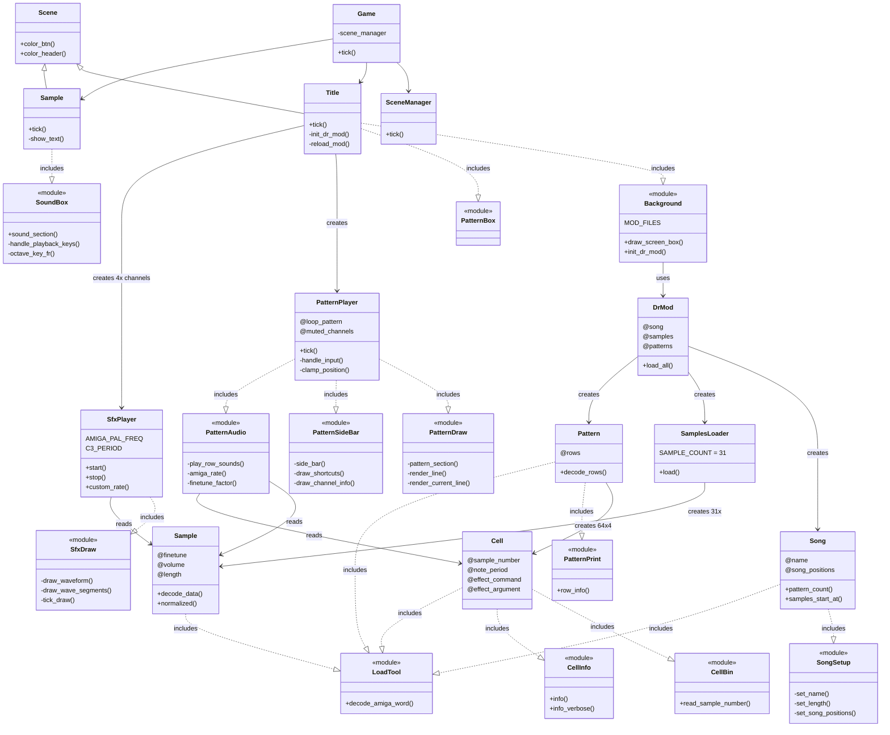

# Architecture — dr_mod

> This document must be updated when classes, modules, or
> relationships change. See CLAUDE.md for the reminder.

## Overview

dr_mod has three layers: **App** (DragonRuby game loop, scenes, UI),
**Components** (player engines), and **Lib** (MOD file parsing).

## Class Diagram



## Data Flow

### MOD File Loading

```
MOD binary file
    │
    ▼
DrMod.load_all
    ├── Song (header: name, positions, length)
    ├── Pattern × N (64 rows × 4 cells each)
    │       └── Cell (sample_number, note_period, effects)
    └── Sample × 31 (header + audio data)
            └── normalized_data (float array -1.0..1.0)
```

### Audio Playback

```
Pattern row → Cell (note_period, sample_number)
    │
    ▼
PatternAudio.amiga_rate(period, finetune)
    hz = 7093789.2 / (period * 2) × 2^(finetune/96)
    │
    ▼
one_shot_lambda → sample.normalized_data (once)
    │
    ▼
args.audio[:channel_N] = { input: [1, rate, lambda], gain: vol/64 }
```

### Scene Navigation

```
Game.tick
    │
    ▼
SceneManager
    ├── Title (tracker view) ──[S]──► Sample (waveform view)
    │       ▲                              │
    │       └──────────[C]─────────────────┘
    │
    └── Controls:
        Space: play/pause    M: sound on/off
        L: loop pattern      1-4: mute channels
        F5: reload MOD       R: reset
```

## Module Responsibilities

| Module | Role | Used by |
|--------|------|---------|
| LoadTool | Binary parsing (Amiga word decode) | Song, Pattern, Cell, Sample |
| CellBin | Cell byte decoding (sample number) | Cell |
| CellInfo | Cell display formatting | Cell |
| SongSetup | Song header parsing | Song |
| PatternPrint | Pattern console output | Pattern |
| SamplePrint | Sample console output | Sample |
| PatternDraw | Pattern grid rendering | PatternPlayer |
| PatternSideBar | Sidebar UI | PatternPlayer |
| PatternAudio | MOD sample playback | PatternPlayer |
| SfxDraw | Waveform rendering | SfxPlayer |
| Background | Screen borders, MOD loading | Title |
| SoundBox | Playback controls, keyboard | Sample |

## Key Constants

| Constant | Value | Location |
|----------|-------|----------|
| AMIGA_PAL_FREQ | 7,093,789.2 Hz | SfxPlayer |
| C3_PERIOD | 214 | SfxPlayer |
| SAMPLE_COUNT | 31 | SamplesLoader |
| MOD_FILES | test .mod paths | Background |
| WAV_SAMPLES | legacy WAV names | PatternAudio |
